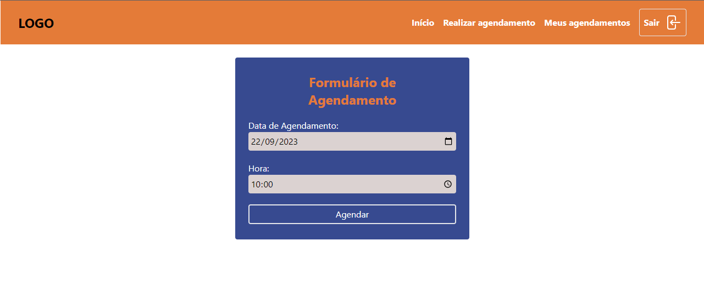
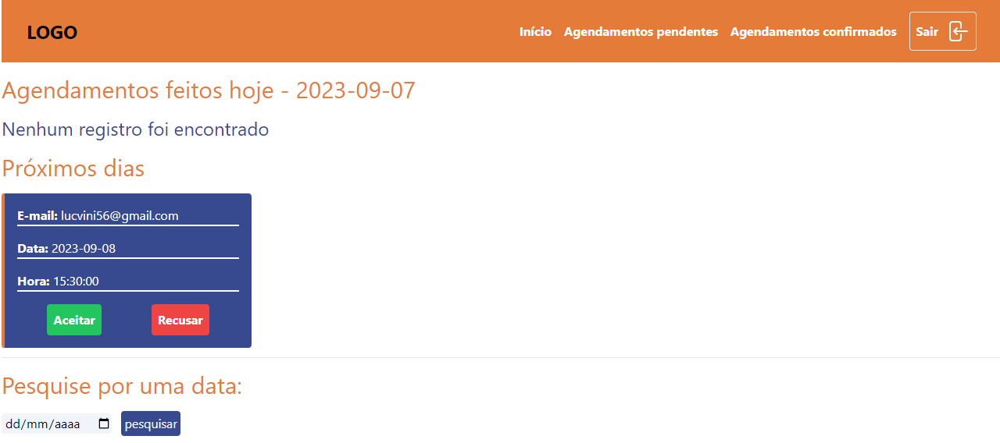
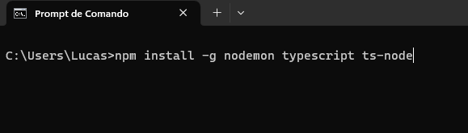
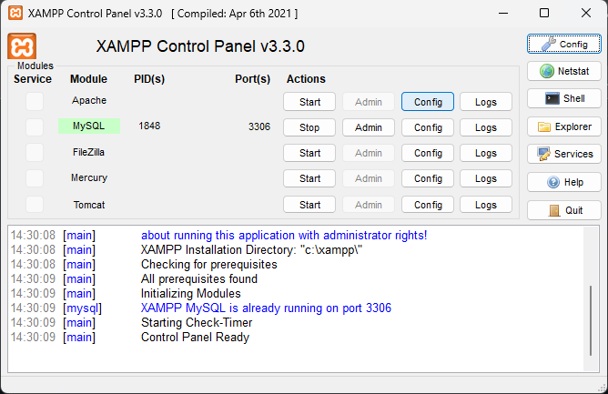
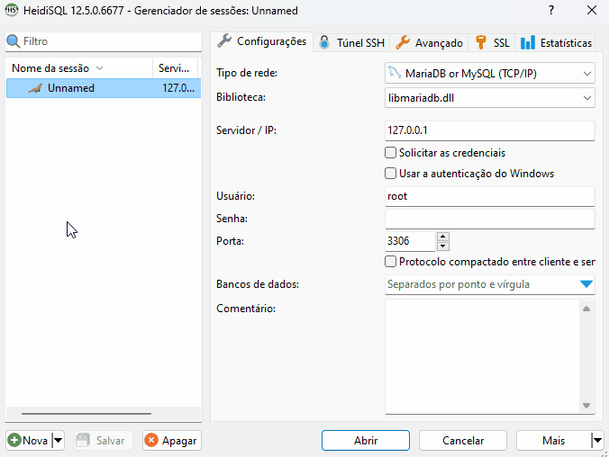
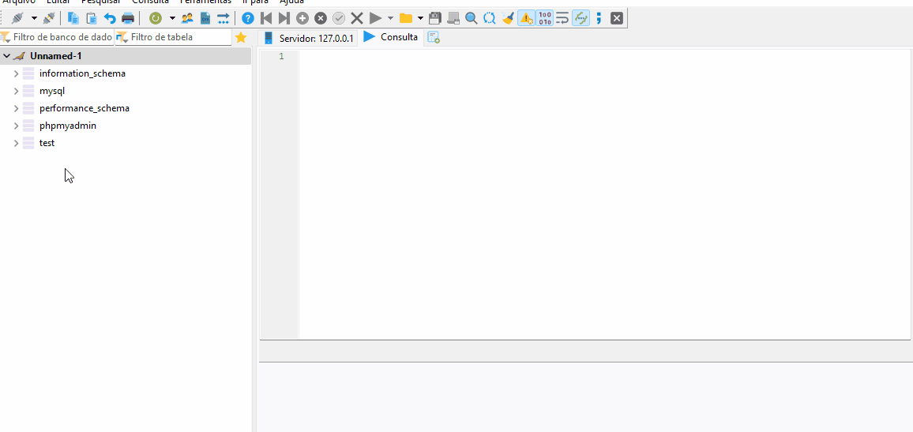
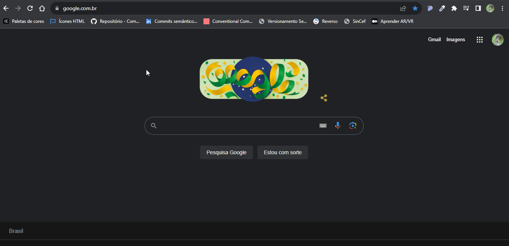

# Agenda Node 
[](https://github.com/lucasdevini/agenda-node/blob/master/LICENSE) 

# Sobre o projeto

Agenda Node é uma aplicação full stack web de cunho autoral que permite a realização, acompanhamento e gerenciamento de agendamentos.

## Layout web




## Funcionalidades
### Usuários:
- Cadastro;
- Realizar agendamento;
- Acompanhamento de agendamentos;
- Redefinção de senha;

### Administrador: 
- Confirmar agendamentos;
- Recusar agendamentos;
- Filtrar agendamentos por data;

# Tecnologias utilizadas
## Back end
- Node.js
## Front end
- Mustache / HTML
- TailwindCSS
- JavaScript / TypeScript
## Banco de dados
- MariaDB

# Como executar o projeto na sua máquina

## Pré-requisitos
- Antes de começar, é necessário que você tenha instalado em sua máquina as seguintes ferramentas: Git, XAMPP, HeidiSQL (ou outra ferramenta semelhante) e Node. Além disso, é interessante ter um editor para melhor visualização dos códigos como o VSCode.

  - link do Git: https://git-scm.com/downloads
  - link do XAMPP: https://www.apachefriends.org/pt_br/index.html
  - link do HeidiSQL: https://www.heidisql.com/download.php
  - link do Node: https://nodejs.org/en/download
  - link do VSCode: https://code.visualstudio.com/Download
  
- Abra o prompt de comando e digite o seguinte comando para instalar as dependências globais necessárias para rodar o projeto: 

```bash
npm install -g nodemon typescript ts-node
```



## Rodando o projeto
- Abra o Git Bash e digite os seguintes comandos nessa ordem: 

```bash
# Acesse a pasta htdocs
$ cd C:/xampp/htdocs
```

```bash
# Clone este repositório
$ git clone https://github.com/lucasdevini/agenda-node.git
```

- Abra o XAMPP e dê um start no MySQL

 

- Abra o HeidiSQL:
  - clique em Nova
  - Apenas copie as configuraçães do gif abaixo e clique em abrir
  


- Ainda dentro do HeidiSQL:
  - Clique com o botão direito sobre a conexão criada
  - Criar novo > Banco de dados
  - Dê o nome ao banco de agenda_node
  - Clique sobre o banco criado e vá até o ícone de pasta na parte superior
  - Procure pelo arquivo agenda_node.sql que está dentro da pasta do projeto
  - Após selecionar o arquivo .sql
 


- Agora abra a pasta do projeto com o VSCode, ou qualquer outro editor de código:
    - abra o prompt integrado (CTRL + ", no VSCode)
    - digite os seguintes comandos nessa ordem:  

    ```bash
    npm install
    ```
    
    ```bash
    npm run build
    ```
    
    ```bash
    npm run start
    ```
    
- Abra seu navegador de preferência e digite a seguinte url: localhost/register



# Credenciais para user e admin padrões do banco de dados do projeto
  - User: 
    - email: user@email.com
    - senha: User1234*

  - Admin:
    - email: admin@email.com
    - senha: Admin1234*

# Autor

Lucas Vinícius Vieira da Silva

# Projeto em desenvolvimento :construction:
